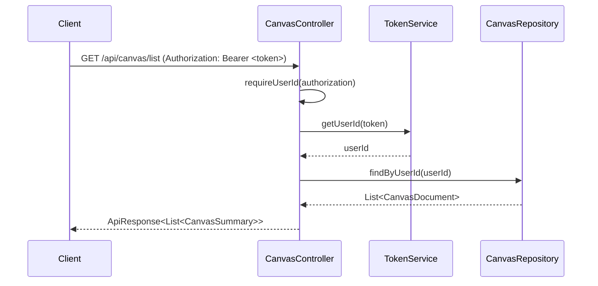
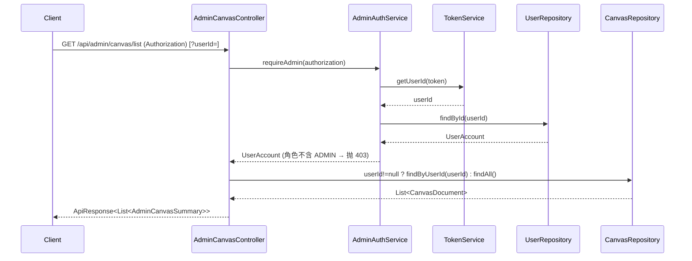
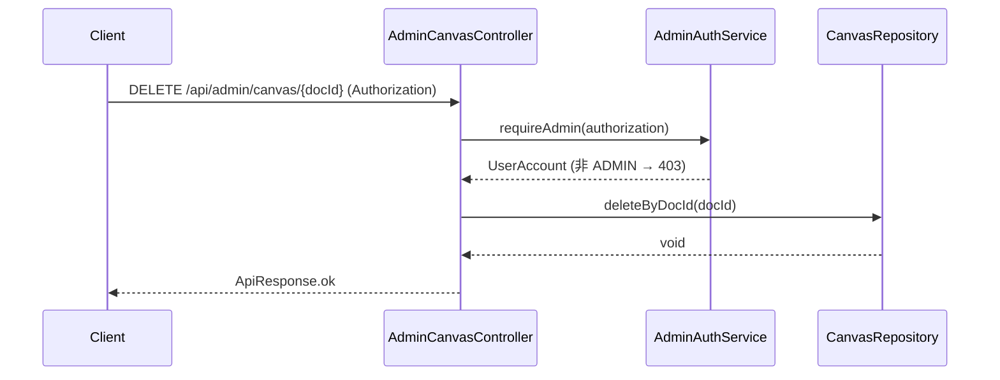
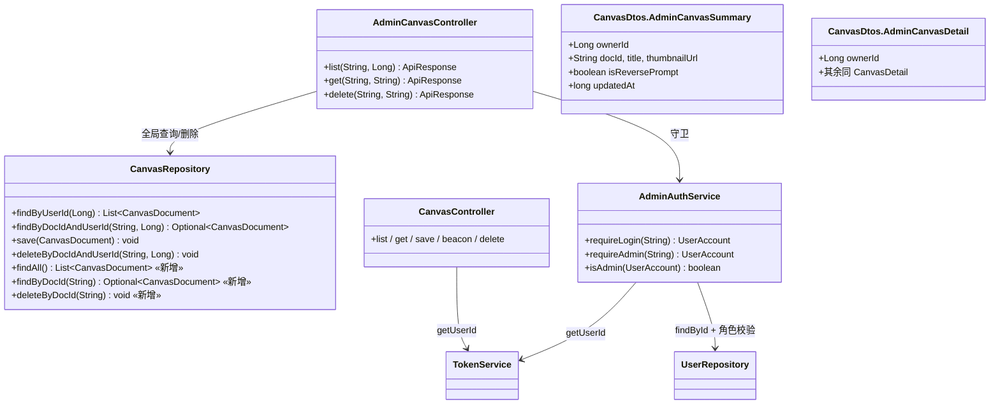

# 画布功能数据隔离机制 — 实现方案与任务分解

> 角色：架构师（高见远）｜范围：youmi 后端（Spring Boot 3 / Java 17 / JdbcTemplate）｜仅设计，不写实现代码

## 1. 实现方案概述

### 1.1 现状判读（基于代码事实，已逐一核对）
- **普通用户隔离已天然成立**：`CanvasController` 所有端点（`/list`、`/{docId}`、`/save`、`/beacon`、`/delete`）都通过私有方法 `requireUserId(authorization)` 从 `Authorization: Bearer <token>` 解析出 `userId`。`userId` 来自 token，**不是客户端参数**，因此普通用户无法伪造他人身份。
- **数据层同样已按 userId 隔离**：`CanvasRepository` 的 `findByUserId` / `findByDocIdAndUserId` / `deleteByDocIdAndUserId` 全部带 `user_id = ?` 过滤；`save` 也始终绑定当前 `userId`，无法越权写他人数据。
- **缺口明确**：目前**没有任何"管理员全局访问"通道**——既无法查看全部用户画布，也无法删除他人画布。这正是本次要补的能力。

### 1.2 设计决策
1. **不改动现有 `/api/canvas/*` 端点**（保持最小风险；普通用户隔离已正确且防篡改）。
2. **新增独立的 `AdminCanvasController`（`/api/admin/canvas/*`）提供管理员全局视图**，而非在现有端点上加 `?admin=true` 之类的开关。原因：
   - 避免向普通用户端点引入"可能绕过隔离"的参数逻辑，从根上杜绝参数篡改风险；
   - 复用 `AdminController` 已有的 `requireAdmin` 守卫范式，安全边界清晰——非管理员访问直接 403，永远拿不到全局查询；
   - 管理员端点与普通端点职责分离，符合"权限分层"语义。
3. **接口层 + 数据层两层隔离同时生效**：
   - 接口层：`AdminCanvasController` 每个方法首行 `adminAuthService.requireAdmin(authorization)`；普通端点首行 `requireUserId`。
   - 数据层：普通走带 userId 过滤的仓储方法；管理员走不带 userId 的全局方法 `findAll` / `findByDocId` / `deleteByDocId`。
4. **复用 `AdminAuthService` 与 "scopeUserId == null 表示全局" 约定**，与 `AdminController.overview` / `imageStats` 完全一致，不另起炉灶。

---

## 2. 文件清单及相对路径

| 文件 | 相对路径 | 操作 | 职责 |
|------|----------|------|------|
| CanvasRepository | `src/main/java/com/youmi/api/canvas/CanvasRepository.java` | 修改(+) | 新增管理员全局方法 `findAll()`、`findByDocId(String)`、`deleteByDocId(String)`；`findByUserId` 复用 |
| CanvasDtos | `src/main/java/com/youmi/api/canvas/CanvasDtos.java` | 修改(+) | 新增 `AdminCanvasSummary`、`AdminCanvasDetail`（含 `ownerId`，供管理员视图） |
| AdminCanvasController | `src/main/java/com/youmi/api/admin/AdminCanvasController.java` | 新增 | 管理员画布全局端点，全部 `requireAdmin` 守卫 |
| CanvasController | `src/main/java/com/youmi/api/canvas/CanvasController.java` | 可选重构 | （可选）统一改用 `AdminAuthService.requireLogin` 解析 token，行为不变；默认不动 |

说明：以下均**复用、不修改**：`CanvasDocument`、`CanvasPayload`、`TokenService`、`AdminAuthService`、`UserAccount`、`UserRepository`、`ApiResponse`/`ApiException`。

---

## 3. 数据模型 / 接口契约

### 3.1 新增仓储方法（CanvasRepository）

```java
// 管理员全局列表：不带 user_id 过滤
public List<CanvasDocument> findAll() {
  String sql = """
      SELECT id, doc_id, user_id, title, payload_json, thumbnail_url, is_reverse_prompt, created_at, updated_at
      FROM ym_canvas_document
      ORDER BY updated_at DESC
      """;
  return jdbcTemplate.query(sql, this::mapRow);
}

// 管理员按 docId 取任意用户画布（全局，不绑 userId）
public Optional<CanvasDocument> findByDocId(String docId) {
  String sql = """
      SELECT id, doc_id, user_id, title, payload_json, thumbnail_url, is_reverse_prompt, created_at, updated_at
      FROM ym_canvas_document
      WHERE doc_id = ?
      LIMIT 1
      """;
  return jdbcTemplate.query(sql, this::mapRow, docId).stream().findFirst();
}

// 管理员删除任意用户画布（按 docId，不绑 userId）
public void deleteByDocId(String docId) {
  jdbcTemplate.update("DELETE FROM ym_canvas_document WHERE doc_id = ?", docId);
}
```
复用：`findByUserId(Long)` 用于管理员按 `?userId=` 筛选（可选功能）；`save` / `deleteByDocIdAndUserId` 供普通用户端点不变。

### 3.2 新增 DTO（CanvasDtos）

```java
// 管理员列表项：在 CanvasSummary 基础上补充归属人
public record AdminCanvasSummary(
    Long ownerId,
    String docId,
    String title,
    String thumbnailUrl,
    boolean isReversePrompt,
    long updatedAt) {
}

// 管理员详情：在 CanvasDetail 基础上补充归属人
public record AdminCanvasDetail(
    Long ownerId,
    String docId,
    String title,
    CanvasPayload payload,
    String thumbnailUrl,
    boolean isReversePrompt,
    long createdAt,
    long updatedAt) {
}
```
> 现有 `CanvasSummary` / `CanvasDetail` / `SaveRequest` 对普通用户端点**仍够用**，无需改动。

### 3.3 新增 AdminCanvasController 端点

| 方法 | 路径 | 守卫 | 行为 |
|------|------|------|------|
| GET | `/api/admin/canvas/list` | `requireAdmin` | 返回全部画布（`AdminCanvasSummary` 列表，含 `ownerId`）。可选 `?userId=` 筛选：有则 `findByUserId`，无则 `findAll()` |
| GET | `/api/admin/canvas/{docId}` | `requireAdmin` | `findByDocId(docId)`，空则 `ApiResponse.fail(404)`；返回 `AdminCanvasDetail` |
| DELETE | `/api/admin/canvas/{docId}` | `requireAdmin` | `deleteByDocId(docId)`，返回 ok |

> 管理员**不提供 save/edit**（画布由本人创建，需求未要求）。如需"恢复/编辑他人画布"属待明确事项（见 §7）。

结构骨架（仅展示契约，非完整实现）：

```java
@RestController
@RequestMapping("/api/admin/canvas")
public class AdminCanvasController {
  private final AdminAuthService adminAuthService;
  private final CanvasRepository canvasRepository;

  public AdminCanvasController(AdminAuthService a, CanvasRepository c) {
    this.adminAuthService = a; this.canvasRepository = c;
  }

  @GetMapping("/list")
  public ApiResponse<List<CanvasDtos.AdminCanvasSummary>> list(
      @RequestHeader(value = "Authorization", required = false) String authorization,
      @RequestParam(value = "userId", required = false) Long userId) {
    adminAuthService.requireAdmin(authorization);                 // 非管理员 → 403
    List<CanvasDocument> docs = (userId != null)
        ? canvasRepository.findByUserId(userId)                   // 可选：按用户筛选
        : canvasRepository.findAll();                             // 全局
    return ApiResponse.ok(docs.stream().map(d -> new CanvasDtos.AdminCanvasSummary(
        d.userId(), d.docId(), d.title(), d.thumbnailUrl(),
        d.isReversePrompt(), d.updatedAt())).toList());
  }

  @GetMapping("/{docId}")
  public ApiResponse<CanvasDtos.AdminCanvasDetail> get(
      @PathVariable String docId,
      @RequestHeader(value = "Authorization", required = false) String authorization) {
    adminAuthService.requireAdmin(authorization);
    return canvasRepository.findByDocId(docId)
        .map(d -> ApiResponse.ok(new CanvasDtos.AdminCanvasDetail(
            d.userId(), d.docId(), d.title(), d.payload(), d.thumbnailUrl(),
            d.isReversePrompt(), d.createdAt(), d.updatedAt())))
        .orElse(ApiResponse.fail(404, "画布不存在"));
  }

  @DeleteMapping("/{docId}")
  public ApiResponse<Object> delete(
      @PathVariable String docId,
      @RequestHeader(value = "Authorization", required = false) String authorization) {
    adminAuthService.requireAdmin(authorization);
    canvasRepository.deleteByDocId(docId);
    return ApiResponse.ok(java.util.Map.of("docId", docId));
  }
}
```

### 3.4 关于 `?userId=` 筛选的建议
**建议支持（可选功能）**：管理员控制台常需要"查看某用户的画布"。该参数仅在 `requireAdmin` 之后生效，非管理员永远到不了这行，因此安全。实现上直接复用已有 `findByUserId(userId)`。默认实现可包含此参数（`required = false`）。

---

## 4. 程序调用流程（Mermaid）

### 4.1 普通用户 list（保持现状，不改动）


### 4.2 管理员 list（全局 / 可选按用户）


### 4.3 管理员删除他人画布


### 4.4 类 / 契约关系


---

## 5. 任务列表（有序、含依赖）

| 任务 | 名称 | 涉及文件 | 依赖 | 优先级 |
|------|------|----------|------|--------|
| T1 | 仓储层新增管理员全局方法 | `CanvasRepository.java` | 无 | P0 |
| T2 | DTO 新增管理员视图（含 ownerId） | `CanvasDtos.java` | 无 | P0 |
| T3 | 新增 AdminCanvasController（requireAdmin 守卫） | `AdminCanvasController.java`（新建） | T1, T2 | P0 |
| T4 | 一致性自查与回归（防篡改 / 守卫全覆盖；可选 CanvasController 重构） | `CanvasController.java`（可选）、`AdminCanvasController.java`、本文档 | T1, T2, T3 | P1 |

**执行顺序**：T1、T2 可并行 → T3 → T4。

- **T1**：新增 `findAll()`、`findByDocId(String)`、`deleteByDocId(String)`；确认 `findByUserId` 可复用（支持可选 `?userId=`）。
- **T2**：新增 `AdminCanvasSummary`、`AdminCanvasDetail`（含 `ownerId`）。
- **T3**：新建 `AdminCanvasController`，实现三个端点，全部首行 `requireAdmin(authorization)`；list 支持可选 `?userId=`（有则 `findByUserId`，无则 `findAll`）。
- **T4**：① 确认普通用户端点零改动且仍只返回本人数据；② 确认所有 admin 端点均 `requireAdmin` 守卫、无 userId 客户端参数暴露给普通用户；③（可选）将 `CanvasController.requireUserId` 统一改为 `AdminAuthService.requireLogin` 以顺带校验用户未被删除，行为须保持一致；④ 核对接口契约与本文档一致。

（若后续确认需要管理员"恢复/编辑他人画布"或按昵称筛选，再追加 T5。）

---

## 6. 共享知识 / 跨文件约定

- **角色字符串固定为 `"ADMIN"`**（不是 `ROLE_ADMIN`），判定统一用 `adminAuthService.isAdmin(user)`。
- **`scopeUserId == null` 约定为"全局（管理员）"**，非 null 表示按该 userId 过滤——与 `AdminController.overview` / `imageStats` 一致。
- **Token 解析**：管理员端点统一走 `AdminAuthService.requireAdmin` / `requireLogin`；普通用户端点维持现有 `CanvasController.requireUserId`（等价，不引入破坏）。两者最终都依赖 `TokenService.getUserId`。
- **防篡改铁律**：普通用户端点绝不接收任何客户端 `userId` 参数；管理员全局查询只在 `requireAdmin` 校验通过后才执行，非管理员 → 403，永远拿不到 `findAll` / `findByDocId` / `deleteByDocId`。
- **两层隔离**：接口层（守卫）+ 数据层（仓储 userId 过滤 / 全局方法）同时生效。
- **统一响应**：`ApiResponse.ok(data)` / `ApiResponse.fail(code, msg)`；守卫失败由 `ApiException` 统一转 401 / 403。
- **新增端点位置**：所有管理类端点置于 `/api/admin/**`，由 `AdminCanvasController` 或既有 `AdminController` 承载，不在 `/api/canvas/**` 混入管理员逻辑。

---

## 7. 待明确事项（需用户 / team-lead 确认）

1. **管理员 list 是否需要 `?userId=` 按用户筛选？** 我建议支持（可选、安全），便于控制台"查看某用户画布"。
2. **管理员列表是否显示归属人昵称（ownerAccount）？** 需要则在 `findAll` / `findByUserId` 中 JOIN 用户表；建议先返回 `ownerId`，昵称后续增强（避免本次改动过大）。
3. **管理员是否需要"恢复/编辑"他人画布？** 按当前需求不需要，故 `AdminCanvasController` 不含 save/update。若未来需要再扩展。
4. **`CanvasController` 是否重构为统一走 `AdminAuthService.requireLogin`？** 现状 `requireUserId` 仅校验 token，不校验用户是否被删；`requireLogin` 会多一步 `userRepository.findById`。建议保持现状以最小风险，列为可选。
5. **删除他人画布的副作用**：缩略图等文件是否需要在本次一并清理？建议仅删 DB 记录，文件清理后续。
6. **分页**：画布量大时 list 是否需 `page` / `size`？建议先不分页，按需增强。
