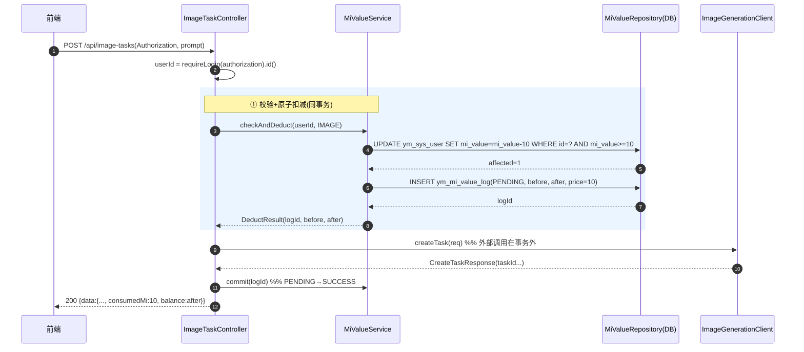
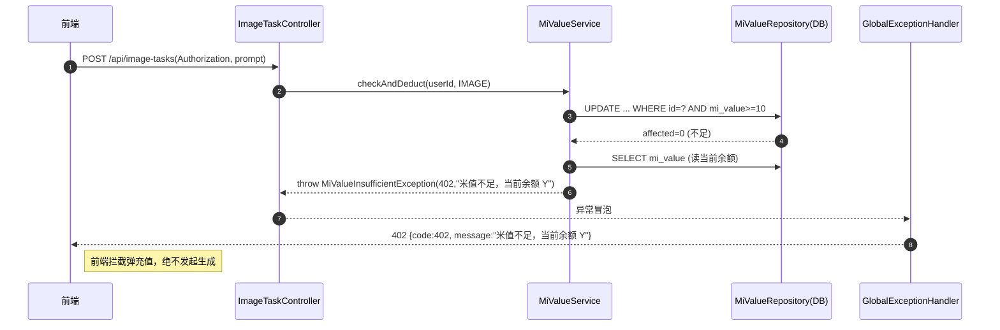
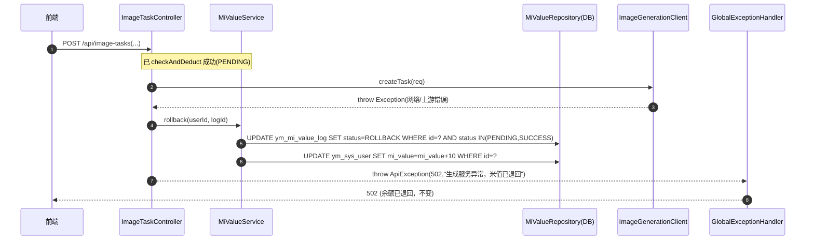
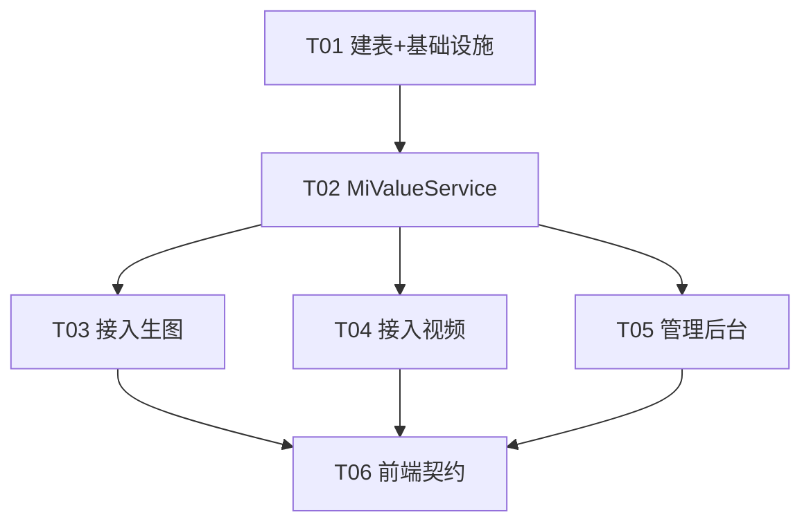

# 米值（额度）消耗逻辑 — 系统架构设计 + 任务分解

> 模块根目录：`youmi/backend/backend_java/`（下文文件均以此根为基准的相对路径）
> 作者：高见远（后端架构师）｜阶段：架构设计（SOP 环节二）
> 核心目标：**防资损第一**，保证「校验余额 → 原子扣减 → 发起生成 →（失败回滚）→ 记流水 → 返回最新余额」闭环一致、可审计。

---

## 一、实现方案 + 框架选型

### 1.1 技术栈（不引入新框架）
- **Spring Boot 3 / Java 17**（既有栈，沿用 `JdbcTemplate` 直连 MySQL，沿用 `ApiResponse`/`ApiException`/`GlobalExceptionHandler` 统一响应与异常处理）。
- **零新依赖**：计费逻辑全部用现有 `spring-jdbc` + `ObjectMapper` + `@ConfigurationProperties` 实现，不引入任何新 Maven 包。
- 数据库：**MySQL**（既有 `schema.sql` / `db/migration/*.sql` 走 Flyway 风格 migration；本期新增表用 `V20260709__mi_value_ledger.sql`）。

### 1.2 闸门落点：**独立服务层 `MiValueService`（显式调用，不用 AOP/拦截器）**

| 方案 | 结论 | 理由 |
|------|------|------|
| A. 独立 `MiValueService`，由 Controller 在外部调用**前后**显式调用 | ✅ **采用（推荐）** | ① 扣减必须在外部付费 API 调用**之前**、回滚必须在调用**之后**；外部调用须放在 DB 事务**之外**（不能边持事务边等外部网络）。② 生图是**异步任务**（apimart/gettoken/proxy 返回 taskId 后轮询），Agnes 图片是**同步**；「生成失败回滚」既可能发生在 `createTask` 抛异常时，也可能发生在后续 `getTask` 轮询到终态 FAILED 时。回滚点分散，**只有显式服务调用能精确编排**，通用拦截器/Aspect 无法表达「提交成功即消费、异步终态失败才回滚」的差异化边界。③ 资损敏感功能要求**可读、可测、可审计**，显式调用最透明。 |
| B. Spring AOP / 拦截器统一拦截「消耗入口」 | ❌ 不采用 | 无法协调「外部调用成功后提交、异步失败后回滚」的非对称生命周期；且拦截器难以安全地把 `logId` 透传给后续的轮询路径。 |

> 因此：`ImageTaskController`（生图）与新建的 `VideoTaskController`（视频）都**注入 `MiValueService`**，在 `create` 方法内按「先扣 → 调外部 → 成功提交/失败回滚」顺序显式编排；异步失败回滚挂在 `getTask` 轮询路径上。

### 1.3 防资损的两道硬保障
1. **并发安全（绝不允许负余额 / 重复扣）**：扣减用**单条条件更新**
   `UPDATE ym_sys_user SET mi_value = mi_value - :price WHERE id = :userId AND mi_value >= :price`；`JdbcTemplate.update` 返回 `affected rows`，**=0 即余额不足**，直接抛 `MiValueInsufficientException(402)`，**绝不在不足时发起外部调用**。该语句在 InnoDB 下行级锁 + WHERE 条件原子求值，并发安全。
2. **一致性与可审计（先扣后生成、失败回滚、流水留痕）**：每次扣减先在 `ym_mi_value_log` 写一条 `PENDING` 流水；外部成功 → 流水置 `SUCCESS`（余额维持扣减）；外部失败 → **幂等回滚**（流水状态守卫 `status IN (PENDING,SUCCESS)` 的单条 UPDATE，命中才 `mi_value + price`），流水置 `FAILED`/`ROLLBACK`。流水是每笔消耗的可审计凭证。

### 1.4 显式排除（不接闸门）
- **AI 智能对话（文本）**：`/api/ai/*`（通义千问文本与视觉能力）—— 不校验、不扣减。
- **元素检测**：`ImageDetectController`（`/api/image-detect/*`）—— 不校验、不扣减。
- 这两类入口在本次设计中**明确标注「排除」**，任何阶段都不得在之上加闸门。

---

## 二、文件列表及相对路径（新增 / 修改）

### 新增文件
| 文件 | 说明 |
|------|------|
| `src/main/java/com/youmi/api/credit/MiBizType.java` | 业务类型枚举：`IMAGE` / `VIDEO` / `ADMIN_ADJUST` |
| `src/main/java/com/youmi/api/credit/MiValueException.java` | `MiValueInsufficientException extends ApiException`（code=402）；可放基类 `MiValueException` |
| `src/main/java/com/youmi/api/credit/MiValueProperties.java` | `@ConfigurationProperties(prefix="youmi.credit")` 单价配置 |
| `src/main/java/com/youmi/api/credit/MiValueRepository.java` | 余额条件更新 + 流水读写（JdbcOperations） |
| `src/main/java/com/youmi/api/credit/MiValueService.java` | 核心：`checkAndDeduct` / `commit` / `rollback` / `getBalance` / `adjustByAdmin` |
| `src/main/java/com/youmi/api/credit/MiValueDtos.java` | `DeductResult`、管理后台请求/响应 DTO |
| `src/main/java/com/youmi/api/video/VideoTaskController.java` | **新建视频生成入口**（本期补后端） |
| `src/main/java/com/youmi/api/video/VideoGenerationClient.java` | 视频生成外部客户端（建议 Agnes 视频 API） |
| `src/main/java/com/youmi/api/video/VideoGenerationDtos.java` | 视频生成请求/响应 DTO |
| `src/main/java/com/youmi/api/admin/AdminMiValueController.java` | 管理后台：查/调用户米值 |
| `src/main/resources/db/migration/V20260709__mi_value_ledger.sql` | 新建消费流水表 `ym_mi_value_log` |

### 修改文件
| 文件 | 改动 |
|------|------|
| `src/main/resources/application.yml` | 新增 `youmi.credit.prices.IMAGE=10` / `VIDEO=50` / `enabled=true` |
| `src/main/java/com/youmi/api/common/GlobalExceptionHandler.java` | `switch` 新增 `case 402 -> HttpStatus.PAYMENT_REQUIRED` |
| `src/main/java/com/youmi/api/image/ImageTaskController.java` | 注入 `MiValueService`；`create` 前扣、后提交/失败回滚；`getTask` 轮询到 FAILED 触发幂等回滚；响应带回 `consumedMi`/`balance` |
| `src/main/java/com/youmi/api/image/ImageGenerationDtos.java` | `CreateTaskResponse` 增加 `consumedMi` / `balance` 字段（前端契约） |
| `src/main/java/com/youmi/api/image/ImageTaskLogService.java` | **废弃** `MI_COST_PER_IMAGE = 15` 的硬编码口径（仅历史账面），成功后按权威单价回填 `mi_cost`（可选，不影响真实扣减） |

---

## 三、数据结构和接口（类图 / 表结构）

### 3.1 消费流水表 `ym_mi_value_log`（建表 SQL）
```sql
CREATE TABLE IF NOT EXISTS ym_mi_value_log (
  id            BIGINT       PRIMARY KEY AUTO_INCREMENT,
  user_id       BIGINT       NOT NULL,
  biz_type      VARCHAR(20)  NOT NULL                COMMENT 'IMAGE / VIDEO / ADMIN_ADJUST',
  task_type     VARCHAR(32)  NULL                    COMMENT '细类审计: TEXT_TO_IMAGE / IMAGE_TO_IMAGE / VIDEO',
  price         INT          NOT NULL                COMMENT '本次单价(米值)',
  before_balance INT         NOT NULL,
  after_balance  INT         NOT NULL,
  task_id       VARCHAR(128) NULL                    COMMENT '关联 ym_image_task.task_id 或视频任务id',
  status        VARCHAR(20)  NOT NULL DEFAULT 'PENDING' COMMENT 'PENDING / SUCCESS / FAILED / ROLLBACK',
  remark        VARCHAR(255) NULL,
  created_at    DATETIME     NOT NULL DEFAULT CURRENT_TIMESTAMP,
  updated_at    DATETIME     NOT NULL DEFAULT CURRENT_TIMESTAMP ON UPDATE CURRENT_TIMESTAMP,
  INDEX idx_log_user   (user_id),
  INDEX idx_log_status (status),
  INDEX idx_log_task   (task_id)
) ENGINE=InnoDB DEFAULT CHARSET=utf8mb4;
```
> 状态机：`PENDING`(扣减后、生成前) → `SUCCESS`(生成成功提交) ｜ `FAILED`(提交即失败，已回滚) ｜ `ROLLBACK`(异步终态失败，已回滚)。回滚幂等靠 `status IN (PENDING,SUCCESS)` 守卫。

### 3.2 `MiValueService` 公开方法签名（设计契约，工程师据此实现）
```java
public class MiValueService {
  /** 原子校验+扣减；不足抛 MiValueInsufficientException(402)；成功写 PENDING 流水并返回 logId 与前后余额 */
  DeductResult checkAndDeduct(Long userId, MiBizType bizType);

  /** 外部生成成功后提交：流水 PENDING→SUCCESS（余额维持扣减） */
  void commit(Long logId);

  /** 外部失败回滚：流水守卫置 ROLLBACK 并加回米值；幂等（重复调用不重复加） */
  void rollback(Long userId, Long logId);

  /** 查询当前余额 */
  int getBalance(Long userId);

  /** 管理后台调账：delta 可正可负，写 ADMIN_ADJUST 流水(SUCCESS) */
  DeductResult adjustByAdmin(Long userId, int delta, String reason);
}

public record DeductResult(Long logId, int beforeBalance, int afterBalance, int price, MiBizType bizType) {}
```
> 单价来源：`MiValueProperties.getPrice(MiBizType)`（IMAGE=10, VIDEO=50），**禁止业务代码硬编码单价**。

### 3.3 管理后台接口
```
GET  /api/admin/user/{id}/mi-value        -> ApiResponse<MiValueDtos.MiValueView>   // {balance, planName}
POST /api/admin/user/{id}/mi-value        -> ApiResponse<MiValueDtos.MiValueView>   // body: {delta:int, reason:String}
```
- 复用 `AdminAuthService.requireAdmin(authorization)` 鉴权（403 无权限）。
- `POST` 调账走 `MiValueService.adjustByAdmin`，写 `ADMIN_ADJUST` 流水。

### 3.4 错误码
| 常量名 | code | HTTP | 文案 |
|--------|------|------|------|
| `MI_VALUE_INSUFFICIENT` | 402 | `402 PAYMENT_REQUIRED`（**需在 `GlobalExceptionHandler` 新增 case**） | `米值不足，当前余额 {balance}` |
| 外部生成失败（已回滚） | 502 | `502 BAD_GATEWAY` | `生成服务异常，米值已退回` |
| 未登录 | 401 | `401 UNAUTHORIZED` | `请先登录`（来自 `requireLogin`） |

---

## 四、程序调用流程（时序图）

> 完整 Mermaid 见 `docs/sequence-diagram.mermaid`。下面为核心三路径。

### 4.1 正常路径（校验→扣减→生成→提交→返回余额）


### 4.2 余额不足路径（拦截、不发起外部调用）


### 4.3 生成失败路径（扣减成功→外部失败→回滚→记流水）

> **异步失败**（apimart 等返回 taskId 后轮询）：前端 `GET /api/image-tasks/{taskId}` → `getTask` 返回 `status=FAILED` → Controller 调 `rollback(userId, logId)`（守卫命中才加回）。视频若也异步，同理挂在 `getVideo` 轮询路径。

---

## 五、任务列表（有序、含依赖、按实现顺序）

> 严格遵循主理人要求的阶段顺序：**建表 migration → Service → 接入生图 → 接入视频 → 管理后台 → 前端契约**。每任务标注「文件 / 动作 / 依赖」。

### T01 — 建表 migration + 基础设施（错误码/枚举/配置）｜P0
- **文件**：
  - 新 `src/main/resources/db/migration/V20260709__mi_value_ledger.sql`
  - 新 `src/main/java/com/youmi/api/credit/MiBizType.java`
  - 新 `src/main/java/com/youmi/api/credit/MiValueException.java`
  - 改 `src/main/java/com/youmi/api/common/GlobalExceptionHandler.java`（加 `case 402`）
  - 改 `src/main/resources/application.yml`（加 `youmi.credit`）
- **动作**：建 `ym_mi_value_log` 表；新增 402 异常 `MiValueInsufficientException` 与 HTTP 402 映射；新增 `MiBizType` 枚举；新增米值定价配置（IMAGE=10/VIDEO=50）。
- **依赖**：无。

### T02 — MiValueService 服务层（核心扣减/回滚/查询/调账）｜P0
- **文件**：
  - 新 `src/main/java/com/youmi/api/credit/MiValueProperties.java`
  - 新 `src/main/java/com/youmi/api/credit/MiValueRepository.java`
  - 新 `src/main/java/com/youmi/api/credit/MiValueService.java`
  - 新 `src/main/java/com/youmi/api/credit/MiValueDtos.java`
- **动作**：实现 `checkAndDeduct`（原子条件更新 + 影响行数判定 + 插 PENDING 流水）、`commit`、`rollback`（状态守卫幂等回滚）、`getBalance`、`adjustByAdmin`；单价从 `MiValueProperties` 读取；所有写操作在同一 `@Transactional` 内保证一致。
- **依赖**：T01。

### T03 — 接入生图入口（ImageTaskController 闸门）｜P0
- **文件**：
  - 改 `src/main/java/com/youmi/api/image/ImageTaskController.java`
  - 改 `src/main/java/com/youmi/api/image/ImageGenerationDtos.java`（加 `consumedMi`/`balance`）
  - 改 `src/main/java/com/youmi/api/image/ImageTaskLogService.java`（废弃硬编码 15，成功回填权威单价，可选）
- **动作**：`create` 前 `requireLogin` 取 userId → `checkAndDeduct(IMAGE)` → `createTask` → 成功 `commit` 并在响应返回 `consumedMi`/`balance`；`createTask` 抛异常 → `rollback(FAILED)` 后抛 502；`getTask` 轮询到终态 FAILED 且流水仍 SUCCESS/PENDING → 幂等 `rollback(ROLLBACK)`。**显式标注 AI 对话 / 元素检测 不接闸门（排除）。**
- **依赖**：T02。

### T04 — 接入视频入口（新建 VideoTaskController + Client + 闸门）｜P1
- **文件**：
  - 新 `src/main/java/com/youmi/api/video/VideoTaskController.java`
  - 新 `src/main/java/com/youmi/api/video/VideoGenerationClient.java`
  - 新 `src/main/java/com/youmi/api/video/VideoGenerationDtos.java`
- **动作**：新建视频生成后端入口（`POST /api/video-tasks`，当前前端为锁定占位，需补后端；建议走 Agnes 视频 API），复用 `MiValueService` 套用与生图完全一致的「校验→扣减→生成→失败回滚→记流水→返回余额」闭环。
- **依赖**：T02。

### T05 — 管理后台（查询/调整用户米值）｜P1
- **文件**：新 `src/main/java/com/youmi/api/admin/AdminMiValueController.java`
- **动作**：`GET /api/admin/user/{id}/mi-value`（返回 balance+planName）；`POST /api/admin/user/{id}/mi-value`（{delta,reason} 增减，写 `ADMIN_ADJUST` 流水）；复用 `AdminAuthService.requireAdmin`。
- **依赖**：T02。

### T06 — 前端契约与拦截（仅接口契约 + 前端待办；实际改动后续阶段）｜P2
- **文件**：无后端代码改动（契约字段已在 T03/T04 的 DTO 中预留）；本任务产出书面契约 + 前端待办清单（见第八节）。
- **动作**：明确前端契约（成功响应含 `consumedMi`/`balance`；不足返回 HTTP 402 + `code:402` + 文案；外部失败 502；未登录 401）；列出前端需配合点（解锁「生成视频」、余额 badge 刷新、拦截 402 弹充值）。
- **依赖**：T03、T04、T05。

### 任务依赖图


---

## 六、依赖包列表

**零新增依赖。** 全部使用既有栈：
- `spring-boot-starter-web`（Controller / 统一响应）
- `spring-jdbc`（`JdbcTemplate` 条件更新 + 流水读写）
- `spring-boot-configuration-processor`（`@ConfigurationProperties` 单价配置，既有）
- `jackson`（`ObjectMapper`，既有）
- MySQL Connector/J（既有数据源）

> 若工程师希望给管理后台 DTO 加 Bean Validation，可用既有 `spring-boot-starter-validation`；非必需，**本期不引入**。

---

## 七、共享知识（跨文件约定）

1. **`biz_type` 枚举值**（常量定义于 `MiBizType`）：
   - `IMAGE` = 生图（文生图 / 图生图，共用同一单价 10）
   - `VIDEO` = 视频生成（单价 50）
   - `ADMIN_ADJUST` = 管理后台调账（流水审计用，非消耗）
2. **错误码常量与 HTTP 映射**：
   - `MiValueInsufficientException`（code=`402`）→ `HttpStatus.PAYMENT_REQUIRED`（**必须在 `GlobalExceptionHandler` 增加 `case 402`**）
   - 外部失败 → `ApiException(502)` → `BAD_GATEWAY`
   - 未登录 → `requireLogin` 抛 `ApiException(401)`
   - 文案：`"米值不足，当前余额 " + balance`
3. **单价常量定义位置**（运营可调价，严禁业务硬编码）：
   - `application.yml` → `youmi.credit.prices.IMAGE: 10` / `youmi.credit.prices.VIDEO: 50`
   - 由 `MiValueProperties`（`@ConfigurationProperties(prefix="youmi.credit")`）注入，`MiValueService` 经 `getPrice(MiBizType)` 取价。
   - ⚠️ **注意**：既有 `ImageTaskLogService.MI_COST_PER_IMAGE = 15` 为**历史账面硬编码**，与产品决策 10 冲突，本期**不得用于真实扣减**，仅可（可选）在成功后回填 `ym_image_task.mi_cost` 以对齐权威单价。
4. **余额不足异常类型名**：`MiValueInsufficientException`（包 `com.youmi.api.credit`）。
5. **原子扣减 SQL（并发安全）**：
   ```sql
   UPDATE ym_sys_user SET mi_value = mi_value - :price WHERE id = :userId AND mi_value >= :price
   -- affected rows = 0 → 不足，抛 402，绝不起外部调用
   ```
6. **回滚 SQL（幂等）**：
   ```sql
   UPDATE ym_mi_value_log SET status='ROLLBACK', updated_at=NOW()
     WHERE id = :logId AND status IN ('PENDING','SUCCESS');  -- 守卫命中才回滚
   UPDATE ym_sys_user SET mi_value = mi_value + :price WHERE id = :userId;  -- 仅在上句命中后执行
   ```
7. **鉴权取 userId**：复用 `AdminAuthService.requireLogin(authorization).id()`（等价于 canvas 模块的 `requireUserId`）；**闸门要求登录态**，未登录返回 401。
8. **统一响应格式**：`ApiResponse<T>{code,message,data}`；成功 `code=0`，失败 `code=异常码`。
9. **排除入口（显式）**：AI 文本对话（`/api/ai/*`）、元素检测（`ImageDetectController` / `/api/image-detect/*`）**不接闸门**。

---

## 八、待明确事项

### 8.1 视频入口定位结论（主理人要求我自行定位）
- **结论：后端当前不存在独立视频生成 Controller**。`grep -ri "video"` 在后端 `src` 中仅命中 `ImageGenerationClient` 的 Agnes 配置与测试类的误匹配；`ecommerce`/`detail` 命中为 prompt 文案误匹配，**无 `VideoGeneration*` Controller/Service**。
- 前端侧：`HomeSidebar.vue` 的「AI 视频 → 生成视频」为 `locked: true` 占位；`HomeComposer.vue` 的 `modes` 含 `'生成视频'` 但未接后端。
- **架构决策**：本期需**新建** `VideoTaskController` + `VideoGenerationClient`（建议走 **Agnes 视频 API** —— `ImageGenerationProperties` 已含 `agnesBaseUrl/agnesApiKey`，团队已有 Agnes 集成经验，可最小化新依赖），并套用与本设计完全一致的 `MiValueService` 闸门。前端后续解除 `locked` 即可联调。
- 若主理人/用户更倾向复用现有 image 包或别的命名，请告知；本设计按「新建 video 包」推进，改动最小且职责清晰。

### 8.2 需用户/主理人拍板的点
1. **初始余额发放**：`ym_sys_user.mi_value DEFAULT 0`（schema 默认 0，产品说"初始如 1000"）。本期闸门只读取当前余额；"新用户送 1000" 不在本期范围，建议另立 PRD（可复用 admin 调账或注册逻辑）。
2. **单价 15 vs 10 冲突**：既有 `mi_cost=15` 与产品 10 不一致，本期以 `MiValueService` 权威单价（10/50）为准；是否回填 `ym_image_task.mi_cost` 由工程师按 T03 可选处理。
3. **异步失败回滚边界**：已设计挂在 `getTask`/`getVideo` 轮询路径；需确认前端轮询行为稳定（现有 `GET /api/image-tasks/{taskId}` 确有持续轮询，满足）。
4. **扣减语义**：采用「先扣后生成，成功即消费，失败回滚」（余额在生成前即减少），与产品"先扣后生成"一致。

### 8.3 前端接口契约（明确，供前端阶段对接）
- **成功**：`POST /api/image-tasks` 与 `POST /api/video-tasks` 返回
  `ApiResponse<CreateTaskResponse>`，`data` 含 `consumedMi`（本次消耗：IMAGE=10 / VIDEO=50）、`balance`（扣减后余额）。
  → 前端展示「本次消耗 X 米值，当前余额 Y」，并刷新余额 badge（或再调 `GET /api/auth/me`）。
- **余额不足**：HTTP **402**，`{code:402, message:"米值不足，当前余额 Y", data:null}`。
  → 前端**拦截**并弹充值引导（跳转充值页），不发起生成。
- **外部生成失败（已回滚，余额不变）**：HTTP **502**，`{code:502, message:"生成服务异常，米值已退回", data:null}`。
  → 前端提示失败、余额无变化。
- **未登录**：HTTP **401** → 引导登录。
- **前端待办清单**：① `HomeComposer` 解锁「生成视频」并接入 `POST /api/video-tasks`；② `HomeSidebar` 取消「AI 视频 → 生成视频」`locked`；③ 无需前端预校验余额（后端 402 为准），但 UI 可展示预估消耗；④ 全局错误拦截监听 402（弹充值）/ 502（提示失败）。

---

> 附：类图见 `docs/class-diagram.mermaid`；时序图见 `docs/sequence-diagram.mermaid`。
